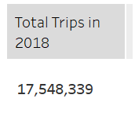
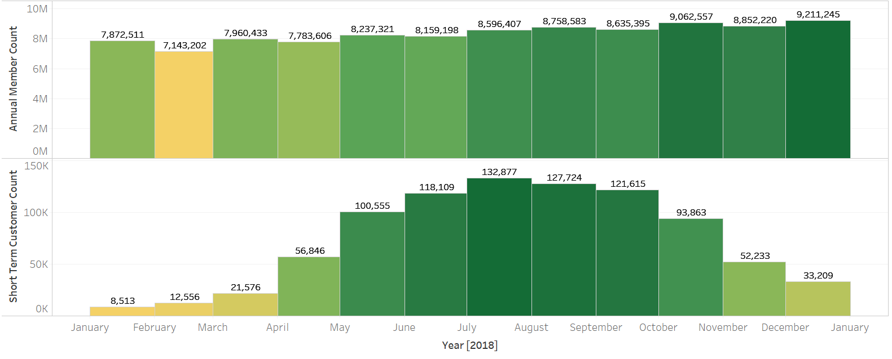
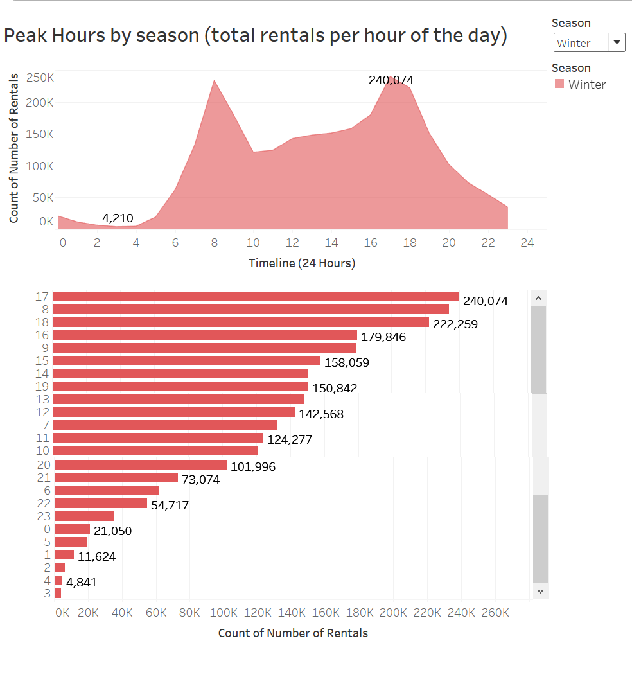
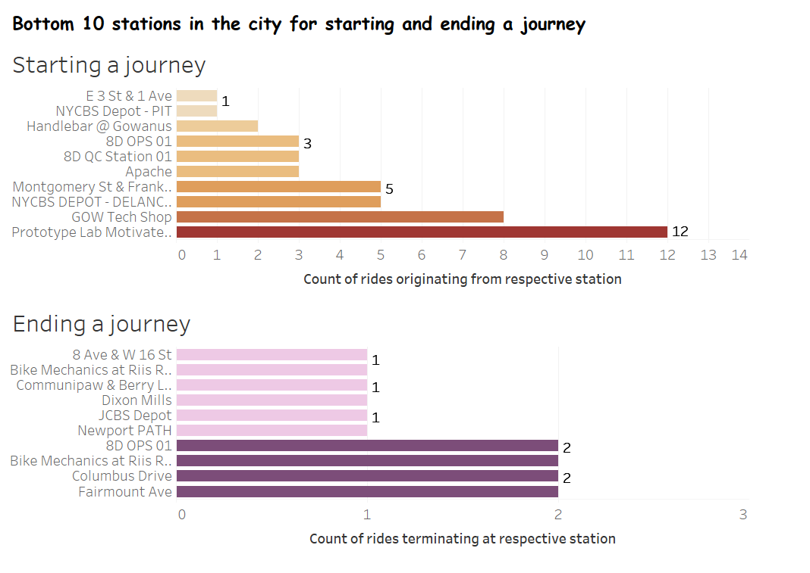
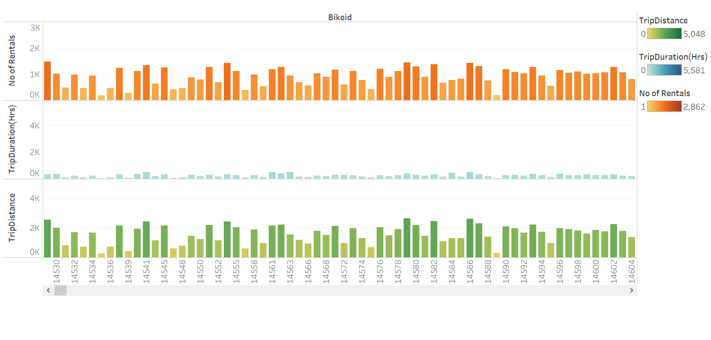
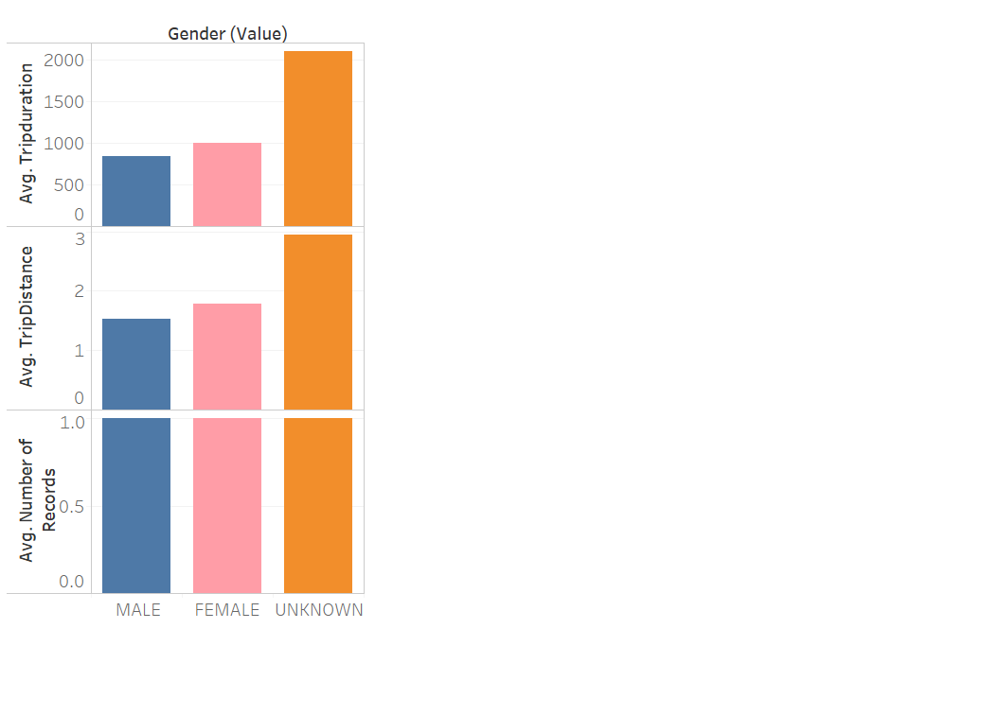
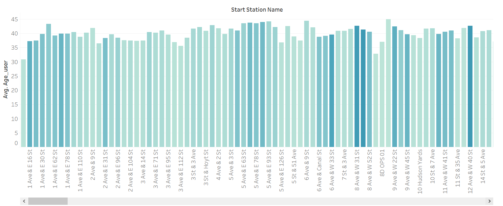
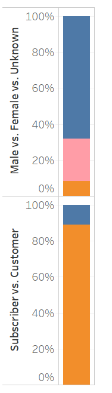
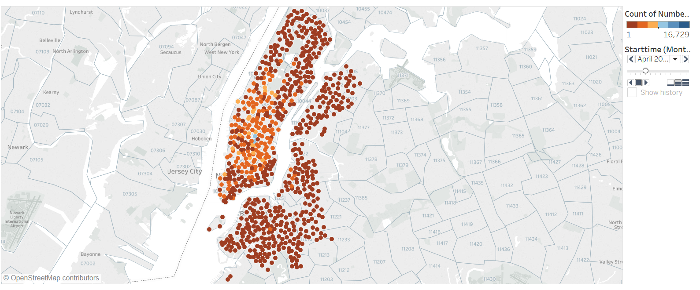
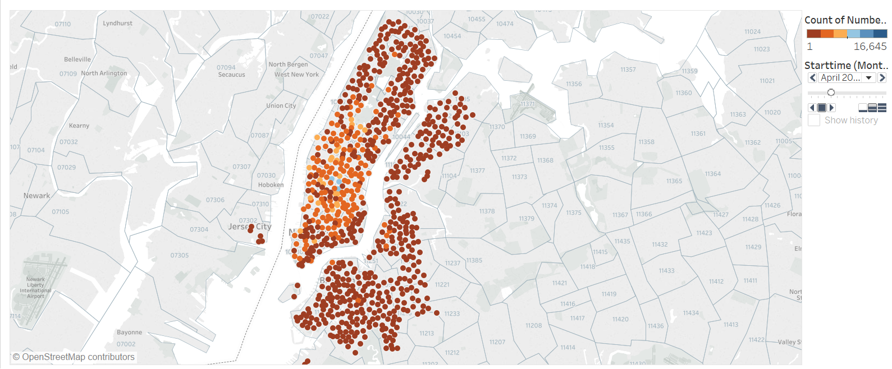

# CitiBike-Tableau

## Data Preparation
This project analyzes the [New York Citi Bike](https://en.wikipedia.org/wiki/Citi_Bike) Program for the year 2018. Data was downloaded from [CitiBike Trip Data](https://s3.amazonaws.com/tripdata/index.html). 

The data for each month was provided as 1 CSV file. Considering all columns were the same name and order, a union function was used to unio all 12 datasets to create the final dataset. Another way this could have been accomplished is by using Python's and Pandas library to merge all CSVs into one file or using any Relational Database, such as SQL Server, to import the CSV files and export the output into a CSV file. Below are some visualization that result in useful information

## Visualizations and Analysis 

### Total Trips in 2018

### Daily Ridership f0r 2018

### Ridership change in 2018

### Short term subscriber growth vs Annual subscriber growth

### Monthly Rentals for 2018 

### Peak Usage Hours

### Top 10 starting station by ride count / popularity

### Bottom 10 starting station by ride count / popularity

### Bike Utilization by Station ID based on duration, trip distance and number of rentals

### Bike Utilization by Age based on duration, trip distance and number of rentals

### Bike Utilization by Gender based on duration, trip distance and number of rentals

### Average age of renters per station

### Subscribers and Users

### Starting Station's Popularity Over Time

	
### Ending Station's Popularity Over Time
