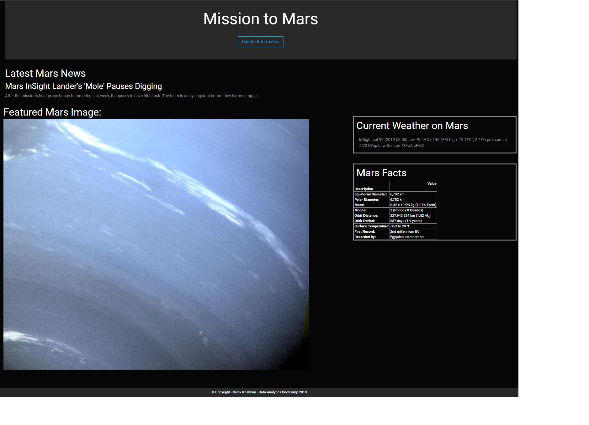

# Mission Mars(Py+WebScraping+MongoDB+HTML)

**Objective:**
Build a web application that scrapes various websites for data related to the Mission to Mars and displays the information in a single HTML page.

**Live link:**

**Solution / Approach**
* Web Scraping - This project is to build a web application that scrapes various websites for data related to the Mission to Mars and displays the information in a single HTML page. The following websites are scraped for this project:
	* [NASA Mars News Site](https://mars.nasa.gov/news/)
	* [JPL NASA site](https://www.jpl.nasa.gov/spaceimages/?search=&category=Mars)
	* [Mars Weather Twitter account](https://twitter.com/marswxreport?lang=en)
	* [Mars Facts Web Page](http://space-facts.com/mars/)
	* [USGS Astrogeology Site](https://astrogeology.usgs.gov/search/results?q=hemisphere+enhanced&k1=target&v1=Mars) 
* Initial scraping was done with Jupyter Notebook using following libraries
	**BeautifulSoup**
	 
	it is a Python library for pulling data out of HTML and XML files. It works with any parser to provide idiomatic ways of navigating, searching, and modifying the parse tree.
	 
	**Pandas**
	 
	this python's data analysis library can be used with BeautifulSoup for web scraping. BeautifulSoup can pass the findings to pandas. Pandas can use its read_html function to read the HTML table data into a dataframe, which can be converted to JSON format.
	 
	**Requests**
	 
	it is a Python library that is used to send HTTP requests, add headers, form data, multiplart files and parameters with simple Python dictionaries, and access the response data in the same way.
	 
	**Splinter**
	 
	it is an open source tool for testing web applications using Python. it lets you automate browser actions, such as visiting URLs and interacting with their items.
	 
* In a file scrape_mars.py, **scrape()** function was defined to execute all of the scraping code and return one Python dictionary containing all of the scrapped data.
* Using Flask, created a route (/scrape) that imports the scrape_mars.py script and call the **scrape** function.
* Using PyMongo stored the return value in Mongo as a Python dictionary. For this project we simply overwrite the existing document each time the `/scrape` url is visited and new data is obtained.
* Created a route (/) that queries the mongo database and passes the mars data into an HTML template to display the data
* Created an index.html file that takes mars data dictionary and displays all the data in appropriate HTML elements.

# Technology / Framework
* Python
* Flask API
* Pandas
* Splinter
* BeautifulSoup
* MongoDB
* HTML/CSS

# Screenshot webpage built

