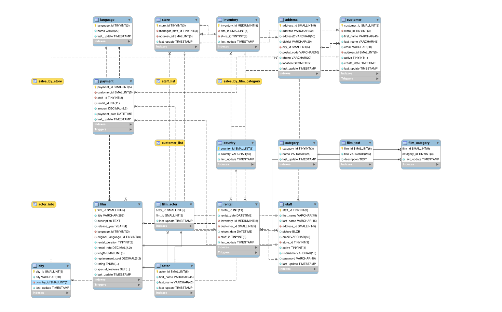

## Schema


## SQL Query list

* 1a. First and last names of all actors from the table `actor`

* 1b. First and last name of each actor in a single column in upper case letters

* 2a. ID number, first name, and last name of an actor, of whom you know only the first name, "Joe." 

* 2b. All actors whose last name contain the letters `GEN`

* 2c. All actors whose last names contain the letters `LI`. Ordered by last name and first name, in that order

* 2d. `country_id` and `country` columns of the following countries: Afghanistan, Bangladesh, and China:

* 3a. Created a column in the table `actor` named `description` and use the data type `BLOB`

* 3b. Deleted the `description` column

* 4a. Last names of actors, as well as how many actors have that last name

* 4b. Last names of actors and the number of actors who have that last name, but only for names that are shared by at least two actors

* 4c. Replace `GROUCHO WILLIAMS` with `HARPO WILLIAMS` in the `actor` table as `GROUCHO WILLIAMS`

* 4d. Change first name of the actor from `HARPO` to `GROUCHO`

* 5a. Re-create schema of the `address` table

* 6a. The first and last names, as well as the address, of each staff member

* 6b. The total amount rung up by each staff member in August of 2005

* 6c. Each film and the number of actors who are listed for that film

* 6d. Count of copies of the film `Hunchback Impossible` exist in the inventory

* 6e. The total paid by each customer listed alphabetically by last name

* 7a. Using subqueries - The titles of movies starting with the letters `K` and `Q` whose language is English

* 7b. Using subqueries - All actors who appear in the film `Alone Trip`

* 7c. Names and email addresses of all Canadian customers

* 7d. All movies categorized as _family_ films

* 7e. The most frequently rented movies in descending order

* 7f. How much business, in dollars, each store brought in

* 7g. For each store its store ID, city, and country

* 7h. List of top five genres in gross revenue in descending order

* 8a. View of the Top five genres by gross revenue

* 8b. Display the view that you created in 8a?

* 8c. Delete the view `top_five_genres`

## Appendix: List of Tables in the Sakila DB

```sql
'actor'
'actor_info'
'address'
'category'
'city'
'country'
'customer'
'customer_list'
'film'
'film_actor'
'film_category'
'film_list'
'film_text'
'inventory'
'language'
'nicer_but_slower_film_list'
'payment'
'rental'
'sales_by_film_category'
'sales_by_store'
'staff'
'staff_list'
'store'
```

