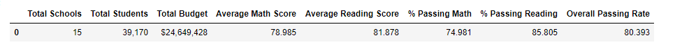
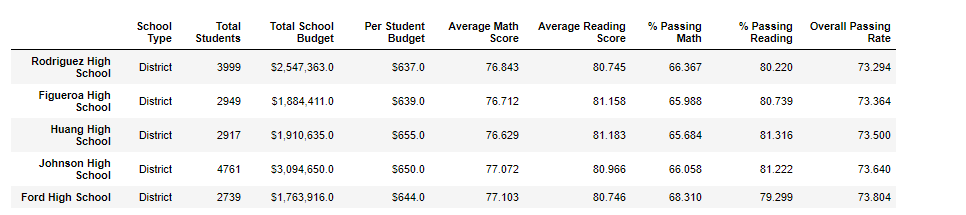
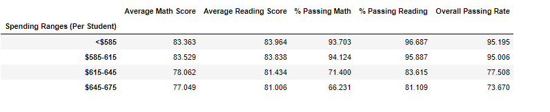

# School Perf Trend Analysis (Py+Pandas)

**Objective:**
Analyze the district-wide standardized test results based on every student's math and reading scores, as well as various information on the schools they attend. The aggregated is to be used to showcase obvious trends in school performance.

**Solution / Approach**
The final report included each of the following:

### District Summary
* Created a high-level snapshot (in table form) of the district's key metrics, including:
  * Total Schools
  * Total Students
  * Total Budget
  * Average Math Score
  * Average Reading Score
  * % Passing Math
  * % Passing Reading
  * Overall Passing Rate (Average of the above two)

  
### School Summary
* Created an overview table that summarizes key metrics about each school, including:
  * School Name
  * School Type
  * Total Students
  * Total School Budget
  * Per Student Budget
  * Average Math Score
  * Average Reading Score
  * % Passing Math
  * % Passing Reading
  * Overall Passing Rate (Average of the above two)
  
### Top Performing Schools (By Passing Rate)
* Created a table that highlights the top 5 performing schools based on Overall Passing Rate. Included:
  * School Name
  * School Type
  * Total Students
  * Total School Budget
  * Per Student Budget
  * Average Math Score
  * Average Reading Score
  * % Passing Math
  * % Passing Reading
  * Overall Passing Rate (Average of the above two)

  
### Bottom Performing Schools (By Passing Rate)
* Created a table that highlights the bottom 5 performing schools based on Overall Passing Rate. Included all of the same metrics as above.

### Math Scores by Grade
* Created a table that lists the average Math Score for students of each grade level (9th, 10th, 11th, 12th) at each school

### Reading Scores by Grade
* Created a table that lists the average Reading Score for students of each grade level (9th, 10th, 11th, 12th) at each school

### Scores by School Spending
* Created a table that breaks down school performances based on average Spending Ranges (Per Student). Used 4 reasonable bins to group school spending. Included in the table each of the following:
  * Average Math Score
  * Average Reading Score
  * % Passing Math
  * % Passing Reading
  * Overall Passing Rate (Average of the above two)

  
### Scores by School Size
* Repeated the above breakdown, but this time group schools based on a reasonable approximation of school size (Small, Medium, Large)

### Scores by School Type
* Repeated the above breakdown, but this time group schools based on school type (Charter vs. District)

# Technology / Framework
* Python
* Pandas

# Analysis / Observable trends 
* No of Students passing reading is about 10% higher than that of math indicating math as a subject might be harder for students to pass
* Overall passing rate for a school is not directly proportional to the school’s budget. We can see schools like Cabrera & Thomas high school have approximately half the budget of a school like Rodriguez but their passing rates are about 20% higher than Rodriguez's passing rate
* Schools with lower spending (<$615) per student actually outperformed schools with higher spending(>$615) per student
* Schools that medium and small in size(<2000) seem to outperform large schools (2000-5000) across all metrics. The math passing rates of medium and small in sized(<2000) schools are about 20% higher than the large schools
* Charter schools seem to have a significant higher passing rate when compared to those of District schools
