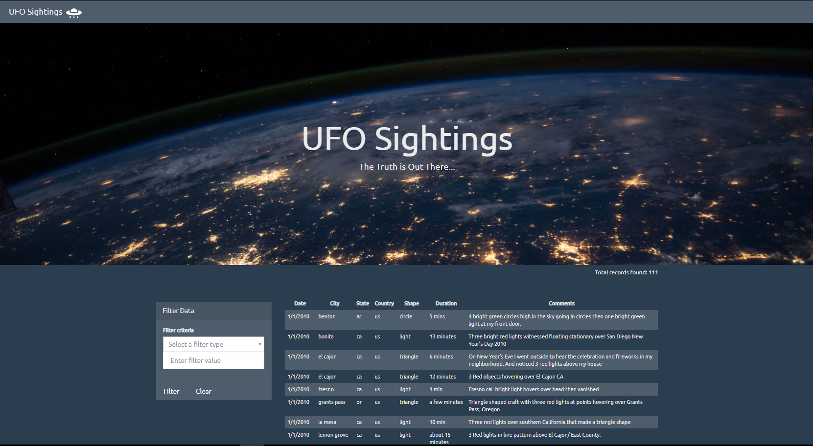
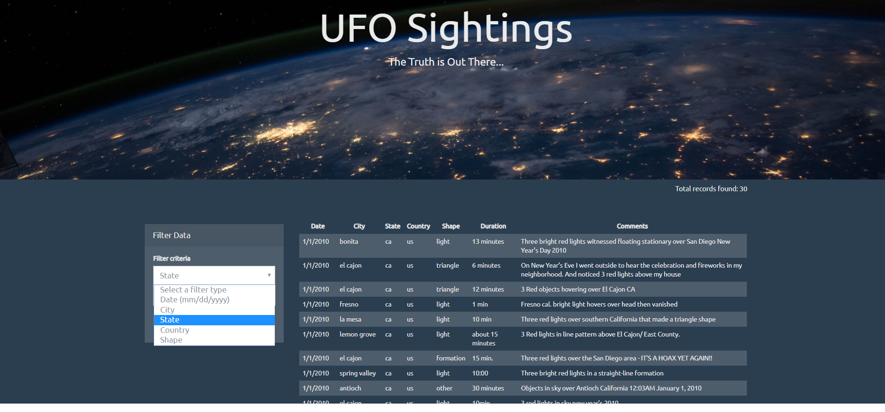

# UFO Sightings (HTML+JS+D3.js)

**Objective:**
Create a HTML web page which renders data from a data.js (array of JavaScript object) file in a table format. Allow filtering of data based on different filtering criteria a table to it.

**Live link:**
[UFO Sightings](https://catchvivkrish.github.io/UFO_Sightings_HTML_JS/)

**Solution / Approach**
* Created a HTML web page
* Using the UFO dataset available in the form of an array of JavaScript objects, used code to appends a table to the web page and then added new rows of data for each UFO sighting
* Used select dropdowns to allow user to select the filter criteria and used JavaScript code that will listen for events and search through the data based on the selected criterial

# Technology / Framework
* HTML
* CSS
* JavaScript
* D3.js

# Analysis / Observable trends 

# Screenshot of the webpage built

# Screenshot of the webpage with filter options
