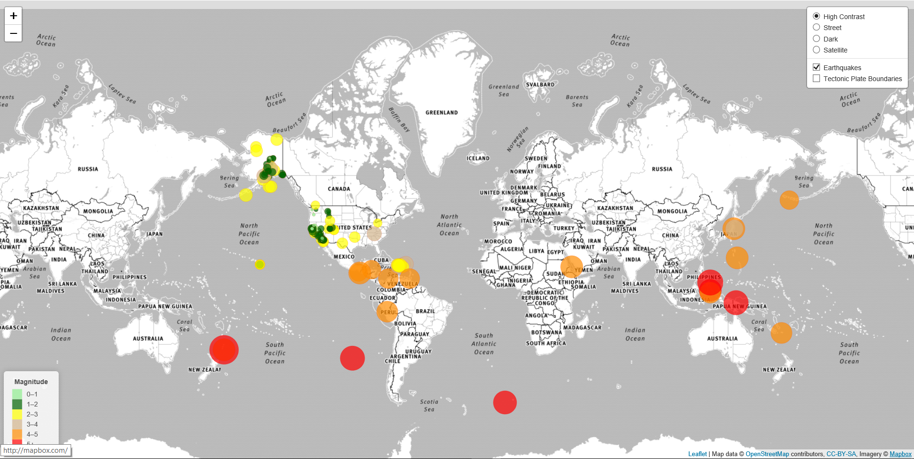

# Geomapping (HTML+Javascript+Leaflet)
**Objective:**
Build an interactive map to visualize [USGS](https://earthquake.usgs.gov/earthquakes/feed/v1.0/geojson.php) earthquake data and illustrate the relationship between tectonic plates [tectonic_plates](https://github.com/fraxen/tectonicplates) and seismic activity using the Leaflet.js library.

**Solution / Approach**
* Created a map using Leaflet that plots all of the earthquakes from your data set based on their longitude and latitude
* Plotted a second data set on our map to illustrate the relationship between tectonic plates and seismic activity
* Used data markers to reflect the magnitude of the earthquake in their size and color. Earthquakes with higher magnitudes should appear larger and darker in color
* Included popups that provide additional information about the earthquake when a marker is clicked
* Create a legend that will provide context for your map data
* Added a number of base maps to choose from as well as separate out our two different data sets into overlays that can be turned on and off independently
* Added layer controls to the map

# Technology / Framework
* Leaflet.js
* HTML/CSS/JavaScript
* Bootstrap

# Screenshot of the webpage built:

