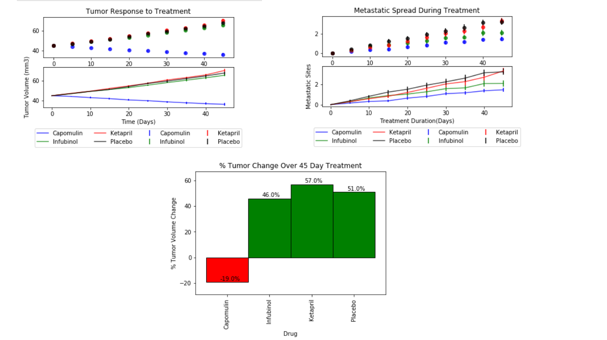

# Pymaceuticals (Python + Matplotlib)

**Objective:**
In a recent animal study, 250 mice were treated through a variety of drug regimes over the course of 45 days as potential treatments to squamous cell carcinoma (SCC), a commonly occurring form of skin cancer. Their physiological responses were then monitored over the course of that time. Your objective is to analyze the data to show how four treatments (Capomulin, Infubinol, Ketapril, and Placebo) compare.

**Solution / Approach**
* Created a scatter plot that shows how the tumor volume changes over time for each treatment.
* Created a scatter plot that shows how the number of [metastatic](https://en.wikipedia.org/wiki/Metastasis) (cancer spreading) sites changes over time for each treatment.
* Created a scatter plot that shows the number of mice still alive through the course of treatment (Survival Rate)
* Created a bar graph that compares the total % tumor volume change for each drug across the full 45 days.

# Technology / Framework
* Python
* Pandas
* Matplotlib

# Analysis / Observable trends 
* The tumor volume increases for most drugs over time with the only exception for mice treated with Capomulin
* The tumor volume increases for mice treated with drugs Infubinol' or 'Ketapril' have a very similar growth as mice treated with a 'Placebo'
* The number of Metastatics sites increases for all drugs over time. The Metastatic sites increases for the drug 'Ketapril' very closely matches that  of the 'Placebo' drug while treating with 'Capomulin' or 'Infubinol' had better results
* The survival rate reduces for all drugs over time. Mice being treated with Capomulin seem to have a much higher survival rate compared to mice treated with all other drugs (including 'placebo')
* Mice treated with Capomulin saw a decrease in the tumor volume whereas mice treated with all other drugs (including 'placebo') saw an increase in the tumor volume

# Screenshot of the output

