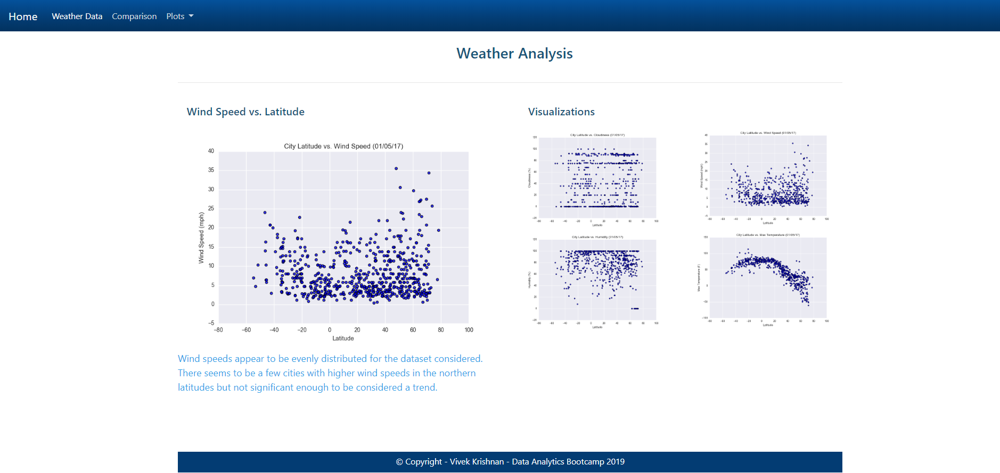

# Weather Analysis Dashboard(HTML+CSS)

**Objective:**
Create a visualization dashboard website using weather data (Latitude vs. Temperature/Humidity/Cloudiness/Windspeed). Create an individual page for each plot and a means by which the user can navigate between them. These pages will contain the visualizations and their corresponding explanations. Also have a landing page, a page where the user can see a comparison of all of the plots, and another page where they can view the data used to build them.

**Live link:**
[Weather Analysis Dashboard](https://catchvivkrish.github.io/Weather_Data_HTML_CSS/index.html)

**Solution / Approach**
* The website will consist of 7 pages total, including:
	* A [landing page](#landing-page) containing:
	  * An explanation of the project
	  * Links to each visualizations page
	* Four [visualization pages](#visualization-pages), each with:
	  * A descriptive title and heading tag
	  * The plot/visualization itself for the selected comparison
	  * A paragraph describing the plot and its significance
	* A ["Comparisons" page](#comparisons-page) that:
	  * Contains all of the visualizations on the same page so the user can easily visually compare them
	* A ["Data" page](#data-page) that:
	  * Displays a responsive table containing the data used in the visualizations
* A the top of every page, there will be a navigation menu that:
	* Has the name of the site on the left of the nav which allows users to return to the landing page from any page.
	* Contains a dropdown on the right of the navbar named "Plots" which provides links to each individual visualization page.
	* Provides two more links on the right: "Comparisons" which links to the comparisons page, and "Data" which links to the data page.
* Entire website will be responsive
* Data is available in the form of a csv file "Resources/cities.csv"

# Technology / Framework
* HTML
* CSS
* Bootstrap
* Bootswatch

# Analysis / Observable trends 
* Cities closer to the equator (latitude 0) have higher temperature when compared to cities away from equator (i.e. latitude close to -90 and latitude close to +90)
* Majority of the cities in the random sample of 501 cities have humidity levels of 60% and higher
* Majority of the cities in the random sample of 501 cities have cloudiness levels of 15% or lower
* Wind speeds for cities in the random sample of 501 cities are quite evenly distributed with a noticeable number of cities not having wind speed data (These cities were still considered in the sample size as they had all the other data points needed for plotting

# Screenshot of the webpage built
#### Landing Page

#### Comparison Page

#### Data Page

#### Latitude vs. Max Temperature

#### Latitude vs. Humidity

#### Latitude vs. Cloudiness

#### Latitude vs. Wind Speed
